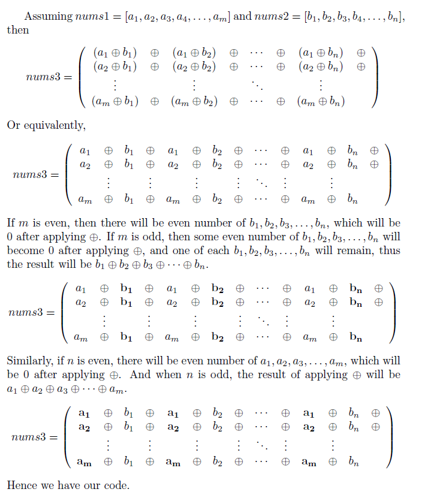

# Medium

You are given two 0-indexed arrays, $nums1$ and $nums2$, consisting of non-negative integers. There exists another array, $nums3$, which contains the bitwise XOR of all pairings of integers between $nums1$ and $nums2$ (every integer in $nums1$ is paired with every integer in $nums2$ exactly once).

Return the bitwise XOR of all integers in $nums3$.



```cpp
class Solution {
public:
    int xorAllNums(vector<int>& nums1, vector<int>& nums2) {
        int ret = 0;
        
        if (nums1.size() % 2)
            for (int x : nums2)
                ret ^= x;
        
        if (nums2.size() % 2)
            for (int x : nums1)
                ret ^= x;

        return ret;
    }
};
```
