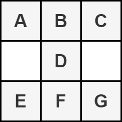

# Medium

You are given an $m \times n$ integer matrix $grid$.

We define an hourglass as a part of the matrix with the following form:



Return the maximum sum of the elements of an hourglass.

Note that an hourglass cannot be rotated and must be entirely contained within the matrix.

```cpp
class Solution {
public:
    int maxSum(vector<vector<int>>& grid) {
        int m = grid.size();
        int n = grid[0].size();
        int ret = 0;
        
        for (int i = 1; i + 1 < m; ++i)
            for (int j = 1; j + 1 < n; ++j)
            {
                int s = grid[i - 1][j - 1] + grid[i - 1][j] + grid[i - 1][j + 1]
                      + grid[i][j]
                      + grid[i + 1][j - 1] + grid[i + 1][j] + grid[i + 1][j + 1];
                
                ret = max(ret, s);
            }
        
        return ret;
    }
};
```
