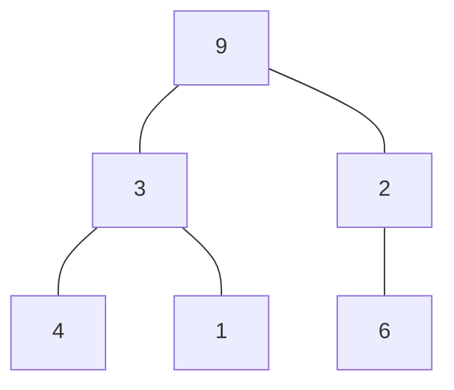

# Medium

One way to serialize a binary tree is to use **preorder traversal**. When we encounter a non-null node, we record the node's value. If it is a null node, we record using a sentinel value such as **'#'**.



For example, the above binary tree can be serialized to the string **"9,3,4,#,#,1,#,#,2,#,6,#,#"**, where **'#'** represents a null node.

Given a string of comma-separated values *preorder*, return **true** if it is a correct preorder traversal serialization of a binary tree.

It is guaranteed that each comma-separated value in the string must be either an integer or a character ***'#'*** representing null pointer.

You may assume that the input format is always valid.

For example, it could never contain two consecutive commas, such as **"1,,3"**.

Note: You are not allowed to reconstruct the tree.

```cpp
class Solution {
public:
    bool travel(string &pre, int &idx)
    {
        while(idx < pre.size() && pre[idx] != ',' && pre[idx] != '#')
        {
            //parse the node data here if needed.
            ++ idx;
        }
        
        // case 1: out of range
        if (idx >= pre.size())
            return false;
        
        // case 2: moving to sub-trees
        if (pre[idx] == ',')
        {
            // case 2-1: check left sub-tree
            if (! travel(pre, ++ idx))
                return false;
            // case 2-2: check right sub-tree
            return travel(pre, ++ idx);
        }
        
        // case 3: find a leaf node
        if (pre[idx] == '#')
        {
            ++ idx;
            return true;
        }
        
        // dummy
        return false;
    }
    
    bool isValidSerialization(string preorder) {
        int idx = 0;
        
        if (travel(preorder, idx))
            // check if there is any thing left.
            return idx == preorder.size();
        
        return false;
    }
};
```
